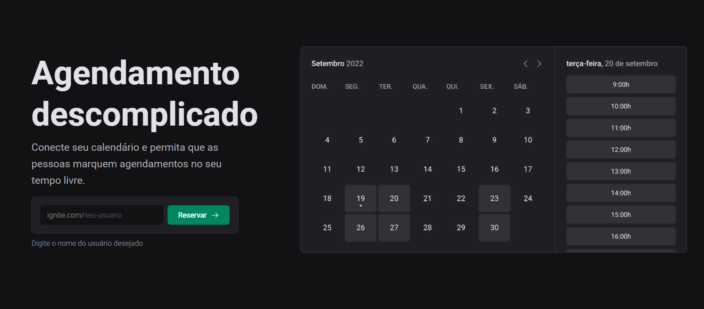
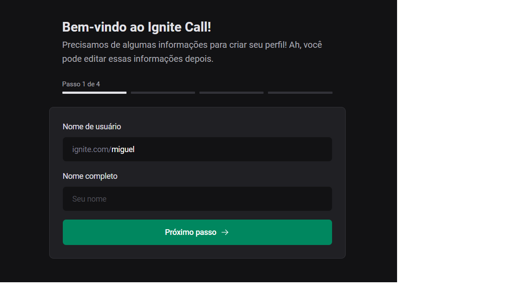
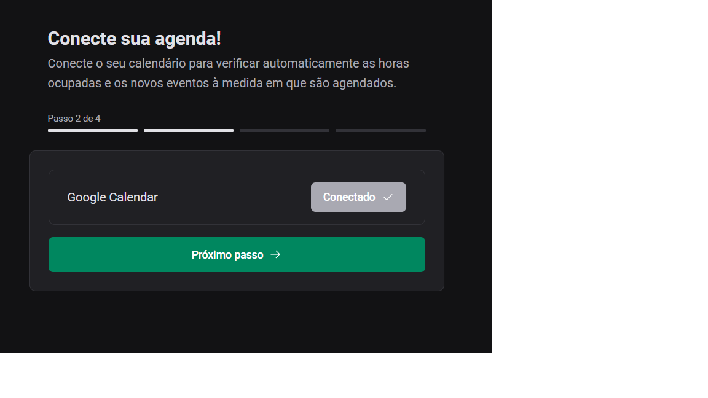
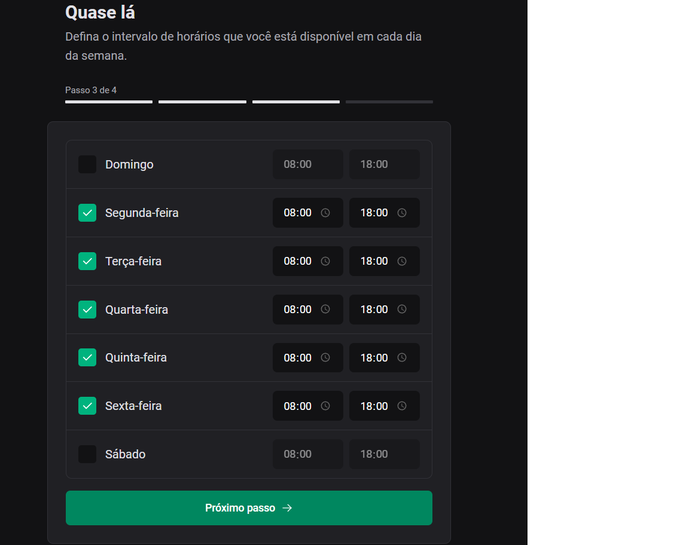
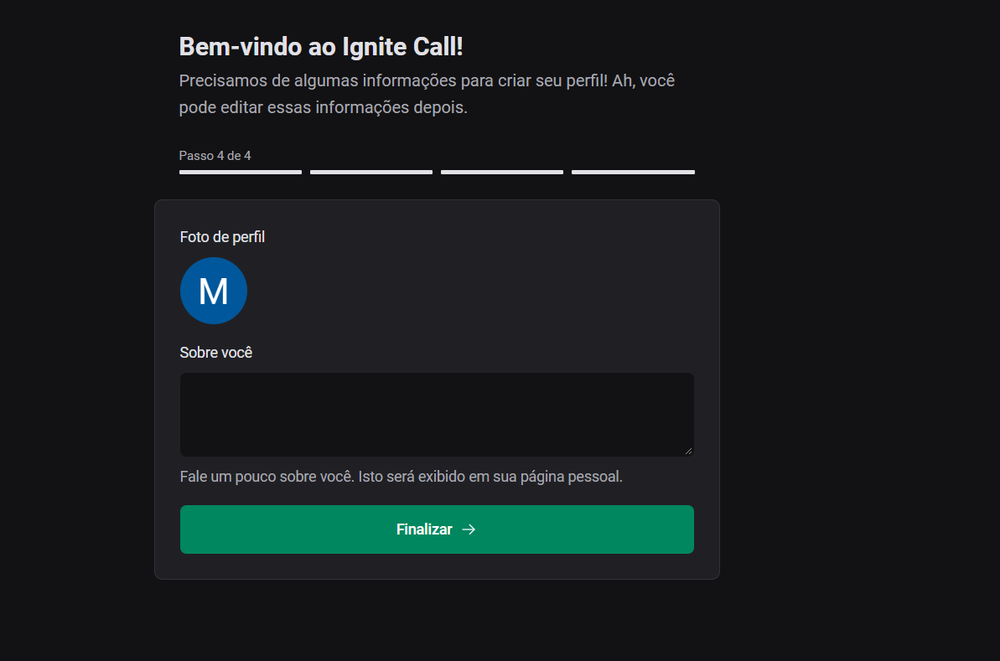
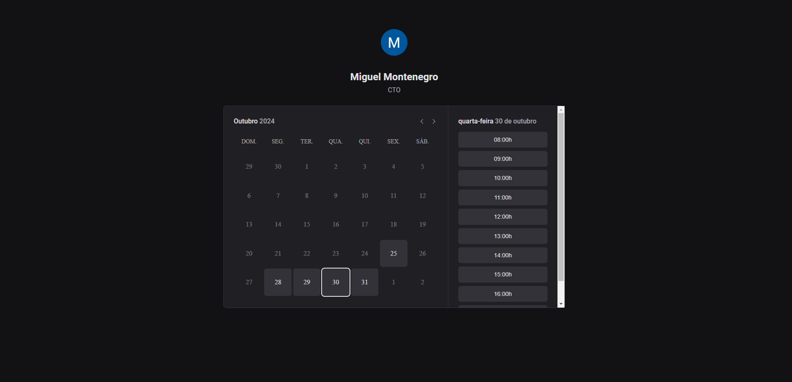
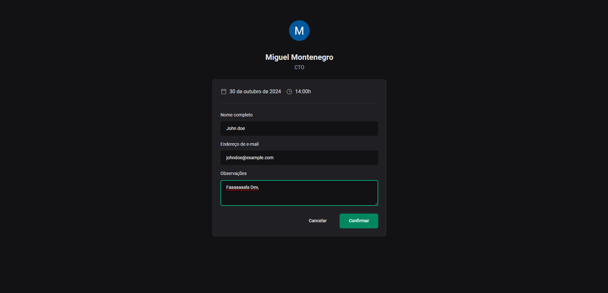
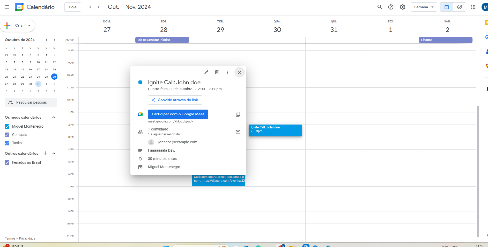

# 06-ignite-call-certo

tecnologias utilizadas: 06-ignite-call:nextjs(framework para React que permite construir aplicações web modernas, funcionalidades como renderização híbrida (SSR - Server-Side Rendering e SSG - Static Site Generation))phosphor-react(biblioteca de icones),react-hook-form(biblioteca para gerenciar formulários em aplicações React.),zod(biblioteca para validação de esquemas em TypeScript),prisma(ORM(object-relational mapping) interface de alto nível para interagir com o banco de dados),axios(biblioteca para fazer requisições HTTP),nookies(biblioteca para gerenciamento de cookies no Next.js),next-auth(biblioteca de autenticação para aplicações Next.js),dayjs(biblioteca de datas),react-query(biblioteca para o gerenciamento de estados assíncronos no React, especialmente para lidar com dados que vêm de APIs.),googleapis(biblioteca oficial do Google APIs para Node.js)

english: 
Technologies used: 06-ignite-call:

Next.js (a framework for React that enables building modern web applications with features like hybrid rendering (SSR - Server-Side Rendering and SSG - Static Site Generation)),
phosphor-react (icon library),
react-hook-form (library for managing forms in React applications),
zod (schema validation library in TypeScript),
prisma (ORM (Object-Relational Mapping) high-level interface for interacting with the database),
axios (library for making HTTP requests),
nookies (library for cookie management in Next.js),
next-auth (authentication library for Next.js applications),
dayjs (date library),
react-query (library for managing asynchronous states in React, especially for handling data from APIs),
googleapis (official library for Google APIs for Node.js).